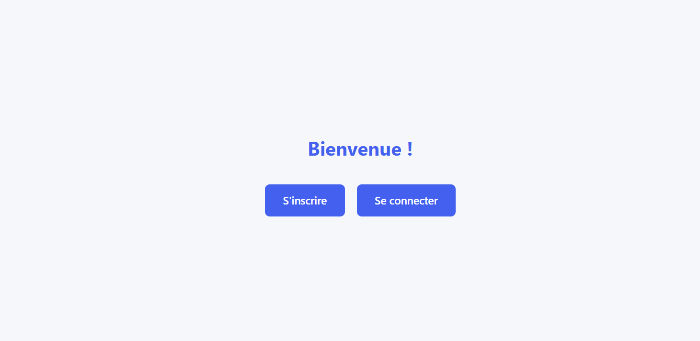
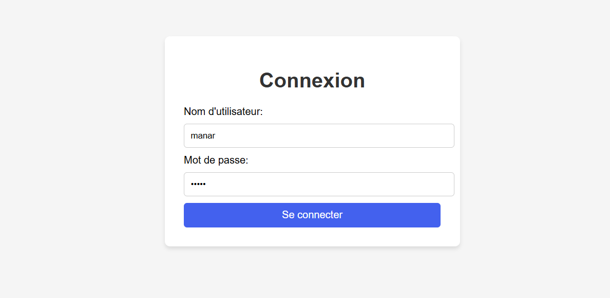
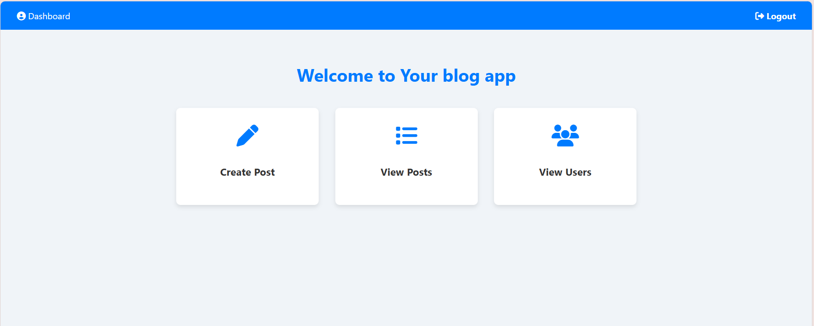
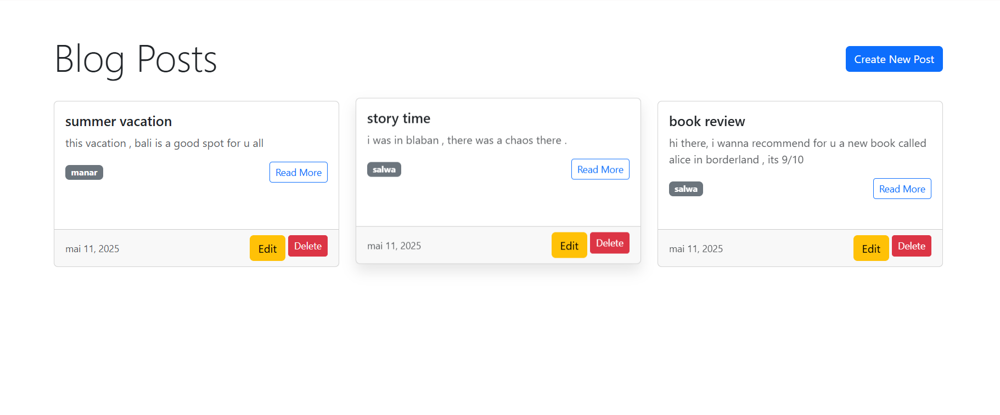

# 📝 Blog Application

A full-stack blog web application built with Java, Spring Boot, and JPA. Users can register, write blog posts, and interact with others through comments — with role-based access and custom permissions.

  
  
  
  

---

## 🚀 Features

- 🔐 **User Authentication**: Login and registration
- ✍️ **Post Management**:
  - Users can create and update their own blog posts
  - ❌ Only the **creator** of a post can delete it
- 💬 **Comment System**:
  - Users can comment on any post
  - ❌ Only the **owner of the post** can delete comments under it
- 🧑‍💻 **Role-based Access**: Differentiation between regular users and admins
- 🧱 **Spring MVC Architecture** with **JPA & Hibernate** for ORM

---

## 🛠️ Tech Stack

## 🧠 Tech Stack & Configuration

| Category       | Technology                          |
|----------------|-------------------------------------|
| Language       | Java 17                             |
| Framework      | Spring Boot 3.4.4                   |
| Build Tool     | Maven                               |
| ORM            | Spring Data JPA (Hibernate)         |
| View Engine    | Thymeleaf                           |
| Testing        | Spring Boot Test                    |
| Database       | H2 (In-Memory)                      |

